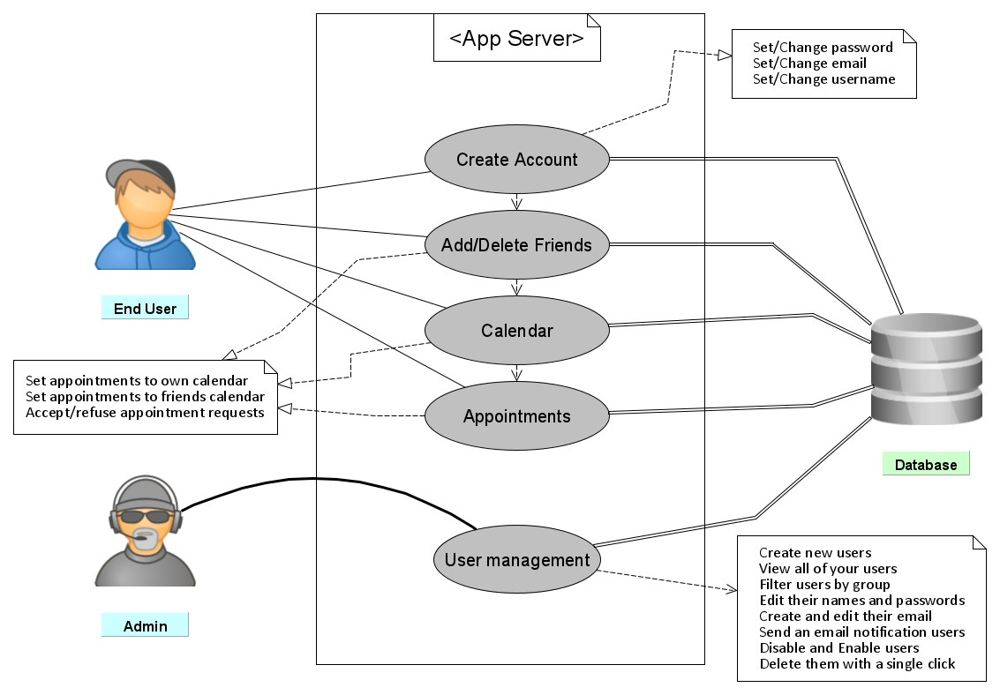
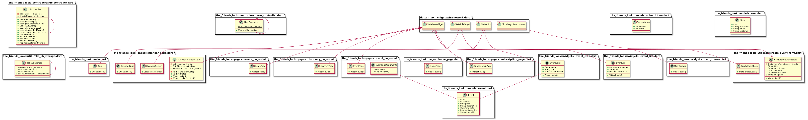

# TheFriendsLook

## Software Architecture Document
For Mobile Application

### Revision History

| Date | Version | Description | Author 
| --- | --- | --- | ---
| 27.04.2020 | 1.0 | First version | Jan Lafferton
| 25.06.2020 | 1.1 | Second version| Mo

# Software Architecture
## 1. Introduction
### 1.1 Purpose
This document provides a comprehensive architectural overview of the system in TheFriendsLook project, using a number of different architectural views to depict different aspects of the system. It is intended to capture and convey the significant architectural decisions which have been made on the system.

### 1.2 Scope
This document describes the technical architecture of TheFriendsLook project, including the classes and use cases.

### 1.3 References
| Title                         | link                                     |
|-------------------------------|------------------------------------------|
| SRS                           | https://github.com/TheFriendsLook/TheFriendsLook/blob/master/doc/SRS.md |
| UCS Calendar                  |https://github.com/TheFriendsLook/TheFriendsLook/blob/master/doc/UCcal.md |
| UCS Create Account 		| https://github.com/TheFriendsLook/TheFriendsLook/blob/master/doc/UCcreat.md	|
| UCS Create Events/Appointments 		| https://github.com/TheFriendsLook/TheFriendsLook/blob/master/doc/UCappo.md |
| mock up Events/Appointments       | https://github.com/TheFriendsLook/TheFriendsLook/blob/master/doc/images/MUappo.jpeg |
| mock Create Account       | https://github.com/TheFriendsLook/TheFriendsLook/blob/master/doc/images/MUcreat.jpeg |
| mock Calander       | https://github.com/TheFriendsLook/TheFriendsLook/blob/master/doc/images/MUCal.JPG |

## 2. Architectural Representation

## 3. Architectural Goals and Constraints
the final goal is to implement a interface between the front end and the server, so that the data is visible to all users. Also it should then be possible to interact between different users.

## 4. Use-Case View

## 5. Logical View

## 6. Metrics
in our blog:
https://thefriendslook.wordpress.com/2020/06/08/week-7-second-term-code-metrics-with-sonarqube/

## 7. Deployment View
n/a

## 8. Implementation View
n/

## 9. Data View
n/a

## 10. Size and Performance
n/a

## 11. Quality
n/a
