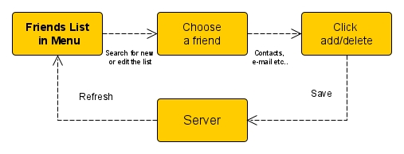

# TheFriendsLook

## Use-Case Specification: <Add/Delete Friends>

Version <1.0>

 
## Revision History
| Date | Version | Description | Author 
| --- | --- | --- | ---
| 25.10.2019 | 1.0 | First version | Mo Mehjazi 

## Table of Contents

### 1.	Use-Case Name	4
1.1	Brief Description	4
### 2.	Flow of Events	4
2.1	Basic Flow	4
2.2	Alternative Flows	4
### 3.	Special Requirements	4

### 4.	Preconditions	4

### 5.	Postconditions	4

### 6.	Extension Points	4
6.1	< add friends from contacts in users’ phone>	4
 
## Use-Case Specification: < Add/Delete Friends >

### 1.	Use-Case Name 
1.1	Brief Description
This use case gives the user the opportunity to add or delete friends. This makes it possible to grant access to the calendar of your friends
### 2.	Flow of Events
2.1	Basic Flow 
•	Choose in the menu the option friends
•	Choose the friends, which you like to add or delete
•	Click at “add friends” or “delete friends”
#### 2.1.1	Flow Diagram

#### 2.1.2	Mock up
tbd
2.2	Alternative Flows
n/a
#### 3.	Special Requirements
n/a
### 4.	Preconditions
User has to be logged in.
### 5.	Postconditions
User is able to see his friend list
### 6.	Extension Points

#### 6.1	<add friends from contacts in users’ phone>
It is possible to add friends automatically from the contacts in Sim card or phone memory.
