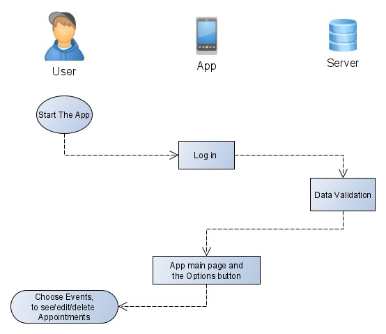

# TheFriendsLook

## Use-Case Specification: <Events/Appointments>

Version <1.0>

 
## Revision History
| Date | Version | Description | Author 
| --- | --- | --- | ---
| 01.12.2019 | 1.0 | First version | Mo

## Table of Contents

### 1.	Use-Case Name	
1.1	Brief Description	
### 2.	Flow of Events	
2.1	Basic Flow	
2.2	Alternative Flows	
### 3.	Special Requirements	

### 4.	Preconditions	

### 5.	Postconditions	

### 6.	Extension Points	
6.1	<Set appointments to own calendar>
6.2 <Set appointments to friends calendar>
6.3 <Accept/refuse appointment requests>	
 
## Use-Case Specification: < Appointments >

### 1.	Use-Case Name 
1.1	Brief Description
This use case is to show the ability to creat events, Send friends appointment requests and to accept or refuse appointments requests.
### 2.	Flow of Events
2.1	Basic Flow 
•	Start the app

•	Go to Events

•	Choose from the Option to creat/delete or show an appointment.

#### 2.1.1	Flow Diagram

#### 2.1.2	Mock up

2.2	Alternative Flows
n/a
#### 3.	Special Requirements
n/a
### 4.	Preconditions
User has to be logged in.
User has to use the calendar.
### 5.	Postconditions
User is able to see and edit his appointments.
### 6.	Extension Points

#### 6.1	<Add Events Pics to describe the Event>
It is possible to add picture to the events to make it more cooler.
