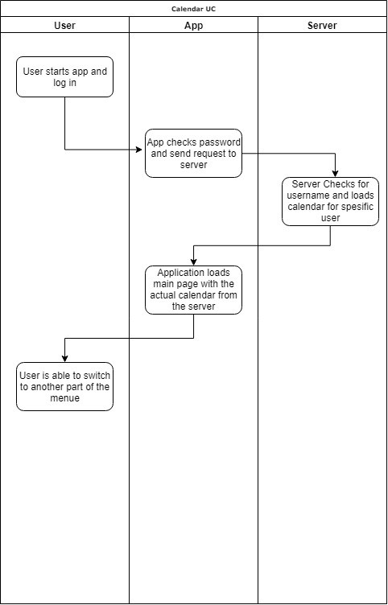
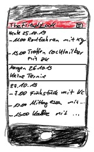

# TheFriendsLook

## Use-Case Specification: <Calendar>

Version <1.0>

 
## Revision History
| Date | Version | Description | Author 
| --- | --- | --- | ---
| 25.10.2019 | 1.0 | First version | Marvin 

## Table of Contents

### 1.	Use-Case Name	4
1.1	Brief Description	4
### 2.	Flow of Events	4
2.1	Basic Flow	4
2.2	Alternative Flows	4
### 3.	Special Requirements	4

### 4.	Preconditions	4

### 5.	Postconditions	4

### 6.	Extension Points	4
6.1	<Switching between different calendar modes>	4
 
## Use-Case Specification: < Calendar >

### 1.	Use-Case Name 
1.1	Brief Description
This use case shows the user his calendar with all his appointments. The calendar should also be the main page when the user starts the application. It should be possible to switch between different calendar modes ( day, week, month) in future.
### 2.	Flow of Events
2.1	Basic Flow 
•	Start the app
•	User can see his actual calendar
#### 2.1.1	Flow Diagram

#### 2.1.2	Mock up

2.2	Alternative Flows
n/a
#### 3.	Special Requirements
n/a
### 4.	Preconditions
User has to be logged in.
### 5.	Postconditions
User is able to see his calendar.
### 6.	Extension Points

#### 6.1	<add friends from contacts in users’ phone>
It is possible to switch between different calendar representations,
e.g. day, week, month, year.
