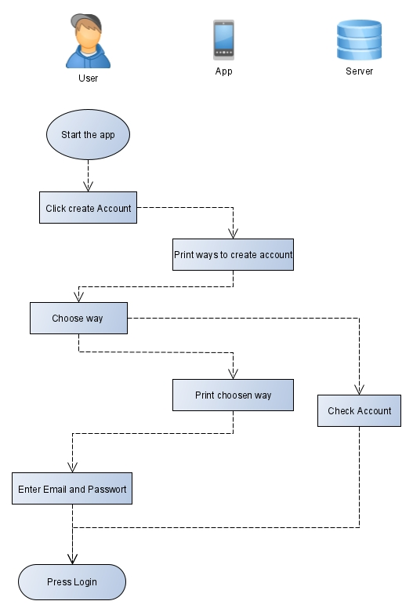
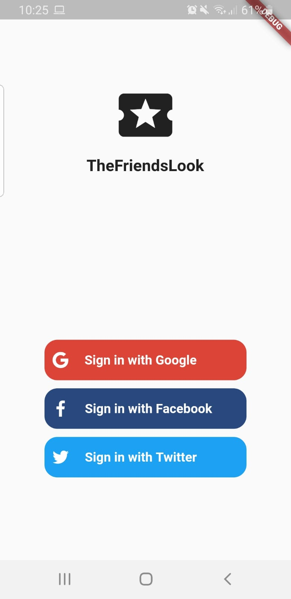

# TheFriendsLook

## Use-Case Specification: <Create Account>

Version <1.0>

 
## Revision History
| Date | Version | Description | Author 
| --- | --- | --- | ---
| 04.12.2019 | 1.0 | First version | Marvin

## Table of Contents

### 1.	Use-Case Name	
1.1	Brief Description	
### 2.	Flow of Events	
2.1	Basic Flow	
2.2	Alternative Flows	
### 3.	Special Requirements	

### 4.	Preconditions	

### 5.	Postconditions	

### 6.	Extension Points	
6.1	<Sign in with Google>
6.2 <Sign in with Email>
6.3 <Sign in with Facebook>	
6.4 <Sign in with Twitter>
 
## Use-Case Specification: < Appointments >

### 1.	Use-Case Name 
1.1	Brief Description
This use case is to show the ability to creat a account. There are diffrent ways to create a account e.g. via Email, Facebook, Google etc.
### 2.	Flow of Events
2.1	Basic Flow 
•	Start the app.

•	if you not registerd jet, click on create account.

•	Choose a way, e.g. Google or Email.

•	enter Email and Password if you had choosen Email

#### 2.1.1	Flow Diagram

#### 2.1.2	Mock up

2.2	Alternative Flows
n/a
#### 3.	Special Requirements
n/a
### 4.	Preconditions
App must be installed
### 5.	Postconditions
User is able to use the app
### 6.	Extension Points

#### 6.1	Add Log in with Email
it is possible to create an account
